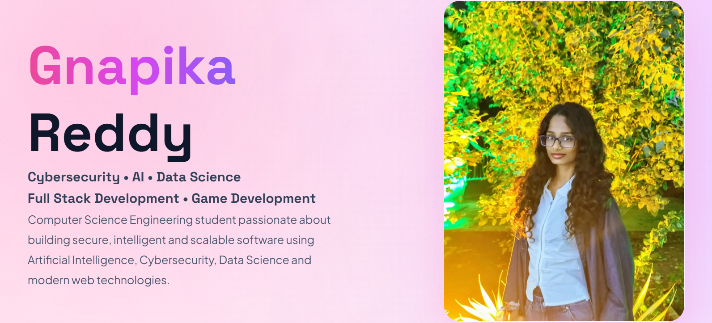

# Gnapika Reddy – Personal Portfolio

A modern, responsive, and animated personal portfolio website showcasing my projects, technical skills, and experience in **Cybersecurity, Artificial Intelligence, Data Science, Full Stack Development, and Game Development**.

Built with a premium UI inspired by modern portfolio designs, featuring smooth animations, glassmorphism, and a clean user experience.

---

## Live Demo

https://deep-shield-deepfake-detection.vercel.app/


---

## Preview



---

## Features

- Modern premium UI design
- Soft pastel pink theme
- Smooth animations
- Fully responsive
- Hero section with profile image
- About section
- Skills showcase
- Featured Projects
- Contact section
- Fast performance with Next.js
- Glassmorphism effects

---

## Tech Stack

### Frontend

- Next.js
- React
- TypeScript
- Tailwind CSS

### Animation

- Framer Motion

### UI

- Lucide React
- React Icons

### Deployment

- Vercel

---

## Project Structure

```
portfolio/
│
├── app/
├── components/
│   ├── common/
│   ├── effects/
│   ├── sections/
│   └── ui/
│
├── public/
│   ├── images/
│   └── icons/
│
├── lib/
├── hooks/
├── constants/
└── README.md
```

---

## Getting Started

### Clone the repository

```bash
git clone https://github.com/gnapiika/portfolio.git
```

### Navigate into the project

```bash
cd portfolio
```

### Install dependencies

```bash
npm install
```

### Start the development server

```bash
npm run dev
```

Open your browser and visit:

```
http://localhost:3000
```

---

## Featured Projects

### DeepShield – Deepfake Detection Platform

An AI-powered web application that detects manipulated images and videos using deep learning techniques.

**GitHub**

https://github.com/gnapiika/DeepShield-Deepfake-Detection

**Live Demo**

https://deep-shield-deepfake-detection.vercel.app/

---

### Personal Portfolio Website

A premium developer portfolio built with Next.js and Tailwind CSS to showcase my projects, skills, and achievements.

---

## Future Improvements

- Blog section
- Dark / Light mode toggle
- Project filtering
- More interactive animations
- Experience timeline
- Certifications section
- Resume download
- Contact form with EmailJS

---

## About Me

I'm a Computer Science Engineering student passionate about building secure and intelligent software.

My interests include:

- Cybersecurity
- Artificial Intelligence
- Data Science
- Full Stack Development
- Game Development

I enjoy learning modern technologies and building real-world projects that combine creativity, security, and innovation.

---

## Connect With Me

GitHub

https://github.com/gnapiika

LinkedIn

www.linkedin.com/in/gnapiika

Email

gnapiika@gmail.com

Portfolio

https://deep-shield-deepfake-detection.vercel.app/

---

## If you like this project

If you found this project interesting, consider giving it a ⭐ on GitHub.

---

## License

This project is open source and available under the **MIT License**.
